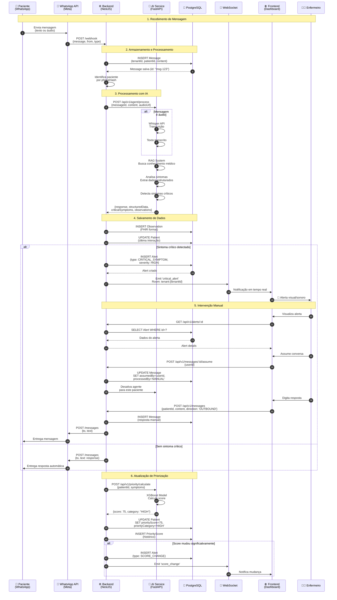
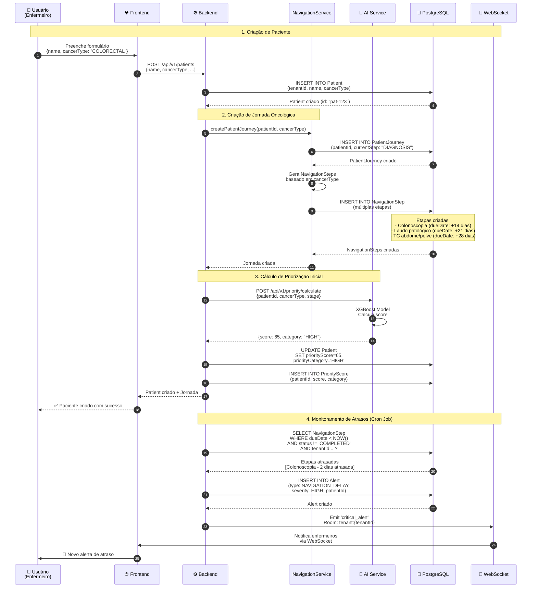
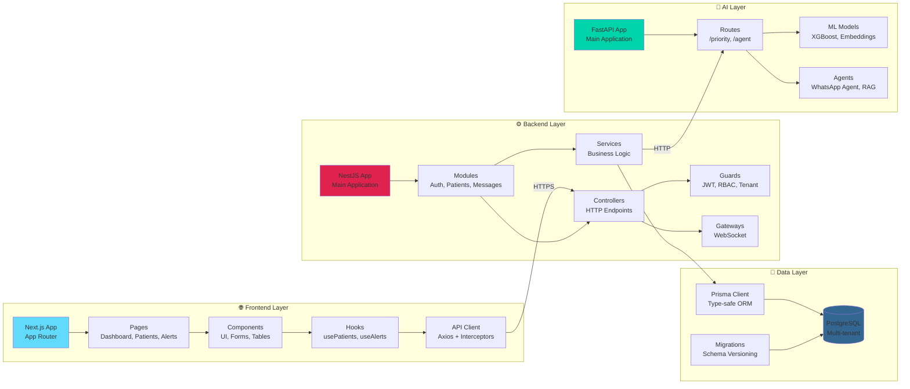
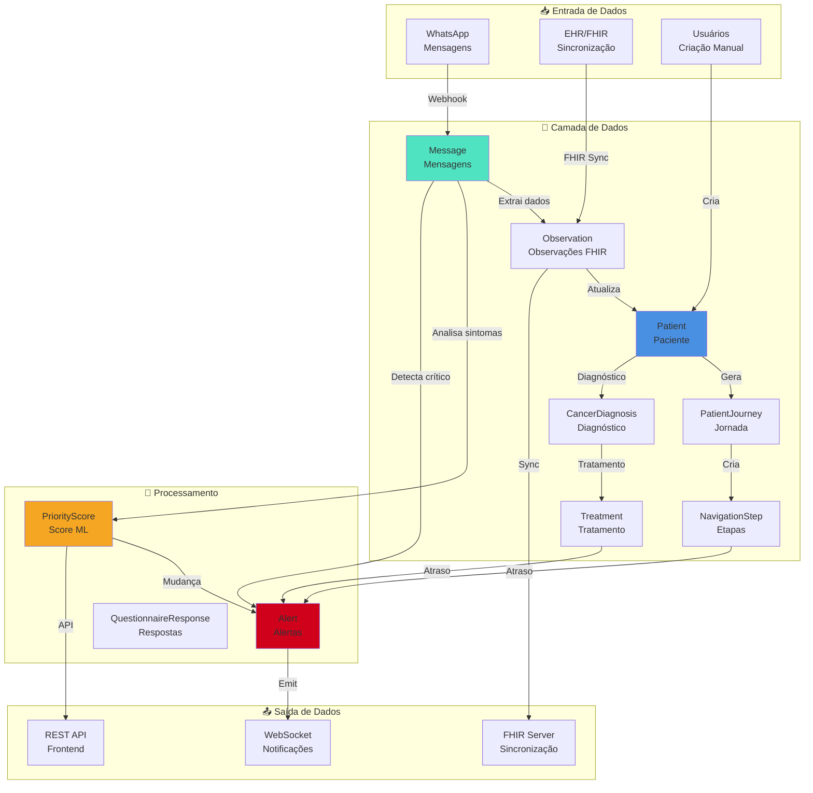

# Diagrama de Arquitetura Visual - OncoSaaS

## Arquitetura Hierárquica - Visão em Camadas

```mermaid
graph TD
    subgraph "Level 3: High-level - Aplicação Principal"
        MAIN[OncoSaaS Platform<br/>Sistema de Navegação Oncológica]
    end

    subgraph "Level 2: Mid-level - Sistemas Principais"
        FE_SYS[Frontend System<br/>Next.js 14 + React]
        BE_SYS[Backend System<br/>NestJS API]
        AI_SYS[AI System<br/>FastAPI]
        DB_SYS[Database System<br/>PostgreSQL]
    end

    subgraph "Level 1: Low-level - Componentes Específicos"
        subgraph "Frontend Components"
            FE_UI[UI Components<br/>Dashboard, Forms, Tables]
            FE_STATE[State Management<br/>Zustand + React Query]
            FE_WS[WebSocket Client<br/>Socket.io]
        end

        subgraph "Backend Modules"
            BE_AUTH[AuthService<br/>JWT, RBAC, MFA]
            BE_PATIENT[PatientService<br/>CRUD, Business Logic]
            BE_MSG[MessageService<br/>WhatsApp Integration]
            BE_ALERT[AlertService<br/>Alert Management]
            BE_NAV[NavigationService<br/>Oncology Navigation]
            BE_PRIORITY[PriorityService<br/>Score Calculation]
        end

        subgraph "Backend Infrastructure"
            BE_WS[WebSocket Gateway<br/>Real-time Updates]
            BE_CRON[Cron Scheduler<br/>Scheduled Tasks]
            BE_FHIR[FHIR Client<br/>EHR Integration]
        end

        subgraph "AI Services"
            AI_PRIORITY[Priority Model<br/>XGBoost ML]
            AI_AGENT[WhatsApp Agent<br/>LLM Conversation]
            AI_RAG[RAG System<br/>Medical Knowledge]
            AI_STT[Speech-to-Text<br/>Whisper]
        end

        subgraph "Database Layer"
            DB_PRISMA[Prisma ORM<br/>Type-safe Queries]
            DB_SCHEMA[Multi-tenant Schema<br/>Isolation per Tenant]
        end
    end

    subgraph "Level 0: External Services"
        EXT_WHATSAPP[WhatsApp Business API<br/>Meta/Facebook]
        EXT_OPENAI[OpenAI API<br/>GPT-4, Whisper]
        EXT_ANTHROPIC[Anthropic API<br/>Claude]
        EXT_FHIR[FHIR Server<br/>External EHR]
        EXT_S3[S3/MinIO<br/>File Storage]
    end

    %% Level 3 -> Level 2
    MAIN --> FE_SYS
    MAIN --> BE_SYS
    MAIN --> AI_SYS
    MAIN --> DB_SYS

    %% Level 2 -> Level 1
    FE_SYS --> FE_UI
    FE_SYS --> FE_STATE
    FE_SYS --> FE_WS

    BE_SYS --> BE_AUTH
    BE_SYS --> BE_PATIENT
    BE_SYS --> BE_MSG
    BE_SYS --> BE_ALERT
    BE_SYS --> BE_NAV
    BE_SYS --> BE_PRIORITY
    BE_SYS --> BE_WS
    BE_SYS --> BE_CRON
    BE_SYS --> BE_FHIR

    AI_SYS --> AI_PRIORITY
    AI_SYS --> AI_AGENT
    AI_SYS --> AI_RAG
    AI_SYS --> AI_STT

    DB_SYS --> DB_PRISMA
    DB_SYS --> DB_SCHEMA

    %% Level 1 -> Level 0
    BE_AUTH --> DB_PRISMA
    BE_PATIENT --> DB_PRISMA
    BE_MSG --> EXT_WHATSAPP
    BE_FHIR --> EXT_FHIR
    BE_PRIORITY --> AI_PRIORITY
    BE_MSG --> AI_AGENT

    AI_AGENT --> EXT_OPENAI
    AI_AGENT --> EXT_ANTHROPIC
    AI_STT --> EXT_OPENAI
    AI_RAG --> EXT_OPENAI

    BE_MSG --> EXT_S3
    AI_STT --> EXT_S3

    style MAIN fill:#4a90e2,stroke:#333,stroke-width:3px
    style FE_SYS fill:#61dafb,stroke:#333,stroke-width:2px
    style BE_SYS fill:#e0234e,stroke:#333,stroke-width:2px
    style AI_SYS fill:#00d4aa,stroke:#333,stroke-width:2px
    style DB_SYS fill:#336791,stroke:#333,stroke-width:2px
```

## Diagrama de Sequência - Fluxo Completo de Mensagem WhatsApp

## Diagrama de Sequência - Criação de Paciente e Navegação Oncológica

## Diagrama de Componentes - Visão Detalhada

## Fluxo de Dados - Arquitetura de Informação

## Legenda dos Diagramas

### Cores e Significados

- 🔵 **Azul** - Frontend (Next.js/React)
- 🔴 **Vermelho** - Backend (NestJS)
- 🟢 **Verde** - AI Service (FastAPI)
- 🔷 **Azul Escuro** - Database (PostgreSQL)
- 🟡 **Amarelo** - Priorização/ML
- 🟠 **Laranja** - Storage (S3)

### Tipos de Setas

- **Seta sólida (→)** - Requisição/Ação
- **Seta tracejada (-→)** - Resposta/Confirmação
- **Seta dupla (↔)** - Comunicação bidirecional

### Níveis Hierárquicos

- **Level 3** - Aplicação principal (alto nível)
- **Level 2** - Sistemas principais (médio nível)
- **Level 1** - Componentes específicos (baixo nível)
- **Level 0** - Serviços externos (infraestrutura)
