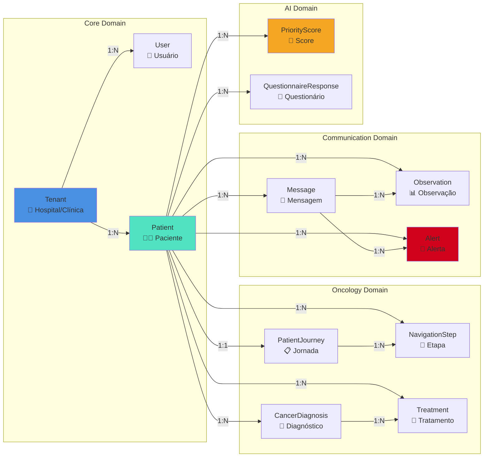
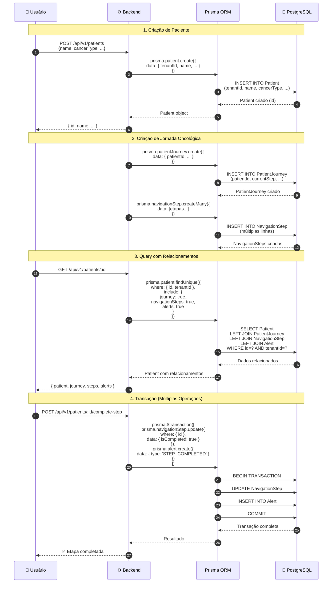
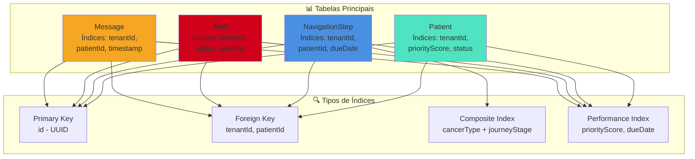
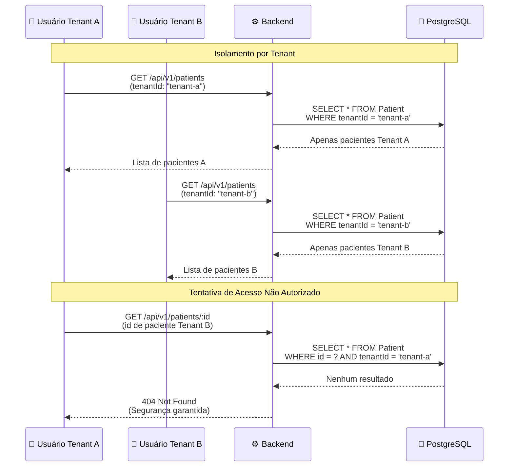
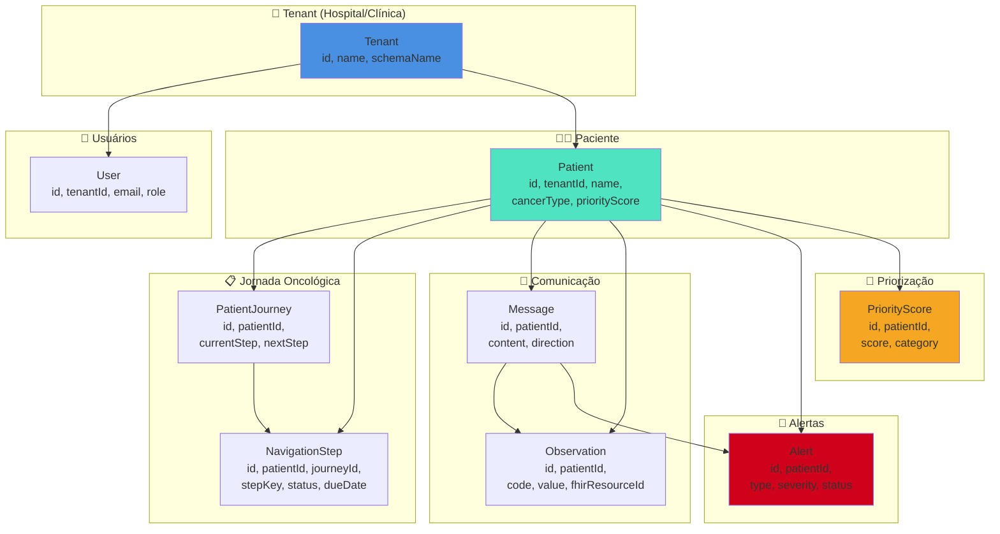

# Diagrama ERD Visual - OncoSaaS

## Arquitetura Hierárquica do Banco de Dados

```mermaid
graph TD
    subgraph "Level 3: High-level - Database System"
        DB_MAIN[PostgreSQL Database<br/>Multi-tenant Architecture]
    end

    subgraph "Level 2: Mid-level - Schemas Principais"
        SCHEMA_TENANT[Tenant Schema<br/>Isolamento por Cliente]
        SCHEMA_SHARED[Shared Schema<br/>Dados Compartilhados]
    end

    subgraph "Level 1: Low-level - Entidades Principais"
        subgraph "Core Entities"
            ENT_TENANT[Tenant<br/>Hospitais/Clínicas]
            ENT_USER[User<br/>Usuários do Sistema]
            ENT_PATIENT[Patient<br/>Pacientes Oncológicos]
        end

        subgraph "Oncology Entities"
            ENT_JOURNEY[PatientJourney<br/>Jornada Oncológica]
            ENT_NAV[NavigationStep<br/>Etapas de Navegação]
            ENT_DIAG[CancerDiagnosis<br/>Diagnóstico]
            ENT_TREAT[Treatment<br/>Tratamentos]
        end

        subgraph "Communication Entities"
            ENT_MSG[Message<br/>Mensagens WhatsApp]
            ENT_OBS[Observation<br/>Observações FHIR]
            ENT_ALERT[Alert<br/>Sistema de Alertas]
        end

        subgraph "AI & ML Entities"
            ENT_PRIORITY[PriorityScore<br/>Scores de Priorização]
            ENT_QR[QuestionnaireResponse<br/>Respostas Questionários]
        end

        subgraph "Integration Entities"
            ENT_WHATSAPP[WhatsAppConnection<br/>Conexões WhatsApp]
            ENT_FHIR[FHIRIntegrationConfig<br/>Config FHIR]
        end

        subgraph "Audit Entities"
            ENT_AUDIT[AuditLog<br/>Logs de Auditoria]
            ENT_NOTE[InternalNote<br/>Notas Internas]
            ENT_INTERV[Intervention<br/>Intervenções]
        end
    end

    subgraph "Level 0: Infrastructure"
        INF_PRISMA[Prisma ORM<br/>Type-safe Queries]
        INF_INDEXES[Database Indexes<br/>Performance Optimization]
        INF_MIGRATIONS[Migrations<br/>Schema Versioning]
    end

    %% Level 3 -> Level 2
    DB_MAIN --> SCHEMA_TENANT
    DB_MAIN --> SCHEMA_SHARED

    %% Level 2 -> Level 1
    SCHEMA_TENANT --> ENT_TENANT
    SCHEMA_TENANT --> ENT_USER
    SCHEMA_TENANT --> ENT_PATIENT
    SCHEMA_TENANT --> ENT_JOURNEY
    SCHEMA_TENANT --> ENT_NAV
    SCHEMA_TENANT --> ENT_DIAG
    SCHEMA_TENANT --> ENT_TREAT
    SCHEMA_TENANT --> ENT_MSG
    SCHEMA_TENANT --> ENT_OBS
    SCHEMA_TENANT --> ENT_ALERT
    SCHEMA_TENANT --> ENT_PRIORITY
    SCHEMA_TENANT --> ENT_QR
    SCHEMA_TENANT --> ENT_WHATSAPP
    SCHEMA_TENANT --> ENT_FHIR
    SCHEMA_TENANT --> ENT_AUDIT
    SCHEMA_TENANT --> ENT_NOTE
    SCHEMA_TENANT --> ENT_INTERV

    %% Level 1 -> Level 0
    ENT_TENANT --> INF_PRISMA
    ENT_USER --> INF_PRISMA
    ENT_PATIENT --> INF_PRISMA
    ENT_JOURNEY --> INF_PRISMA
    ENT_NAV --> INF_PRISMA
    ENT_DIAG --> INF_PRISMA
    ENT_TREAT --> INF_PRISMA
    ENT_MSG --> INF_PRISMA
    ENT_OBS --> INF_PRISMA
    ENT_ALERT --> INF_PRISMA
    ENT_PRIORITY --> INF_PRISMA

    ENT_PATIENT --> INF_INDEXES
    ENT_NAV --> INF_INDEXES
    ENT_ALERT --> INF_INDEXES
    ENT_MSG --> INF_INDEXES

    INF_PRISMA --> INF_MIGRATIONS

    style DB_MAIN fill:#336791,stroke:#333,stroke-width:3px
    style SCHEMA_TENANT fill:#4a90e2,stroke:#333,stroke-width:2px
    style ENT_PATIENT fill:#50e3c2,stroke:#333,stroke-width:2px
    style ENT_ALERT fill:#d0021b,stroke:#333,stroke-width:2px
    style ENT_PRIORITY fill:#f5a623,stroke:#333,stroke-width:2px
```

## Diagrama de Relacionamentos - Core Entities

## Diagrama de Sequência - Operação Completa no Banco

## Diagrama de Índices e Performance

## Fluxo de Dados - Multi-tenancy

## Estrutura de Dados - Visão Simplificada

## Observações Importantes

### Multi-tenancy

- Todos os modelos (exceto `Tenant`) incluem `tenantId`
- Isolamento garantido em todas as queries
- Schema por tenant para escalabilidade

### Índices Principais

- `tenantId` - Isolamento multi-tenant
- `patientId` - Relacionamentos com pacientes
- `priorityScore` - Ordenação e filtros
- `dueDate` - Detecção de atrasos
- `status` - Filtros por status

### Relacionamentos Críticos

- `Patient` → `PatientJourney` (1:1)
- `PatientJourney` → `NavigationStep` (1:N)
- `Patient` → `Message` (1:N)
- `Message` → `Observation` (1:N)
- `Patient` → `Alert` (1:N)

### Performance

- Índices compostos para queries complexas
- Paginação em todas as listagens
- Cache de queries frequentes (React Query)
- Otimização de N+1 queries (Prisma `include`)
